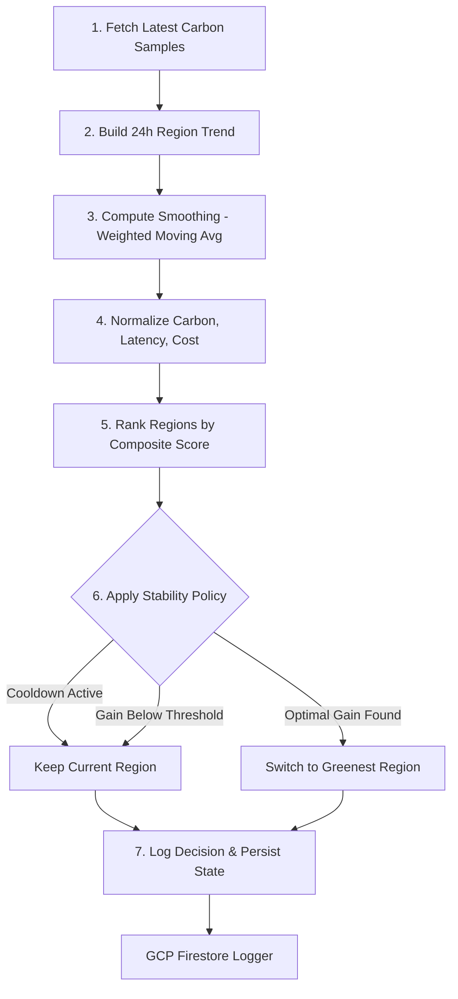

# 🌿 CASS-Lite v2: Carbon-Aware Multi-Region Cloud Orchestrator

**An autonomous, data-driven orchestration system designed to optimize cloud compute workloads across 6 global regions by balancing real-time grid carbon intensity, network latency, and operational costs.**

---

## 🏗️ System Architecture


## 🧠 Decision Flow Logic (The Scheduler "Brain")



## 🚀 Core Engineering Implementation

### 1. Decision Intelligence & Multi-Objective Scoring
Implemented a **normalized scoring engine** that performs weighted aggregation across three primary vectors:
*   **Grid Carbon Intensity (gCO₂/kWh)**: Real-time telemetry from ElectricityMap API.
*   **Network Latency (RTT)**: Geographical proximity weighting to maintain UX performance.
*   **Operational Cost Metrics**: Regional compute pricing differentials.

### 2. System Stability & Hysteresis
To prevent "region thrashing" (rapid, redundant compute migrations), the system implements:
*   **24-Hour Deployment Lock**: A temporal stability window for every orchestration decision.
*   **Hysteresis-Based Control**: Decision logic requires a significant "green gain" threshold before triggering a migration, accounting for cold-start and migration overhead.

### 3. Decoupled Observability & Telemetry
*   **Signal Decoupling**: Separated real-time grid signals from deployment execution to ensure system reliability during API outages.
*   **Traceability**: Enabled historical decision analysis and auditability using a **Firestore-backed telemetry layer**.
*   **Prototyping**: Frontend built using **Streamlit** for rapid observability prototyping and real-time telemetry visualization.

## 🛠️ Tech Stack
*   **Infrastructure**: Google Cloud Platform (Cloud Run, Cloud Functions, Firestore)
*   **Backend**: Python 3.10+ (Pandas for data transformation, python-dotenv for security)
*   **Observability**: Streamlit (SaaS-style Design System with Obsidian/Emerald theme)
*   **Data Source**: ElectricityMap Real-time Grid Signal API

## ⚙️ Quick Start (Local Development)

1.  **Clone the Repo**: 
    ```bash
    git clone https://github.com/Bharathis28/cass.git
    ```
2.  **Add Secrets**: 
    Create a `.env` file in the root and add your `ELECTRICITYMAP_KEY`.
    ```env
    ELECTRICITYMAP_KEY=your_key_here
    ```
3.  **Run Dashboard**: 
    ```bash
    .venv\Scripts\streamlit.exe run dashboard/app.py
    ```

---
*Built with a focus on Distributed Systems Reliability and Sustainable Computing.*
